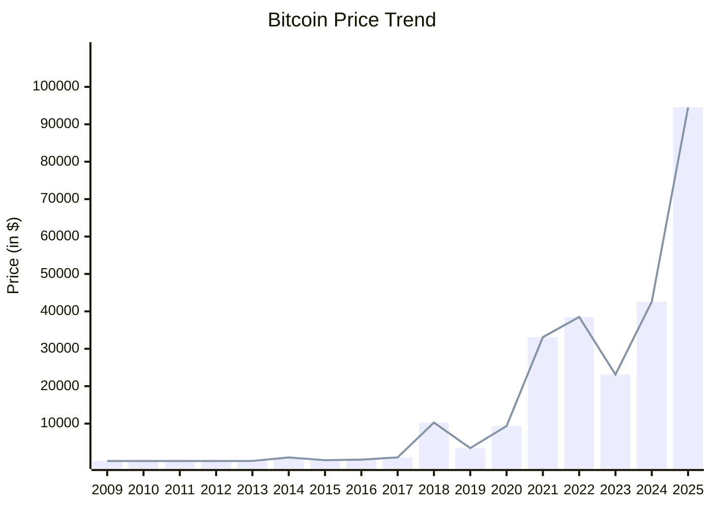

## 入门
- [区块链小白书](https://blockchainlittlebook.com/#/)
## 官网
- [https://bitcoin.org/](https://bitcoin.org)
## 白皮书
- [比特币白皮书](https://bitcoin.org/bitcoin.pdf)
- [比特币白皮书-中文版](https://bitcoin.org/files/bitcoin-paper/bitcoin_zh_cn.pdf)
- [比特币白皮书-中英对照版](https://lixiaolai.com/#/bitcoin-whitepaper-cn-en-translation/Bitcoin-Whitepaper-EN-CN.html)
## 发行总量
> 精确的比特币的发行总量参考Bitcoin Wiki的[Controlled supply](https://en.bitcoin.it/wiki/Controlled_supply)。

比特币自创世区块开始，平均每10分钟打包一个区块。每打包一个区块，最初会产生50个比特币奖励，并且每4年减半一次。为简化计算，假设每年为365天，不考虑闰年。
$$
S = 50 \times 6 \times 24 \times 365 \times 4 \times (1+\frac{1}{2}+\frac{1}{4}+\frac{1}{8}+...+\frac{1}{2^n})
$$
把等比数列用$T$表示
$$
T=1+\frac{1}{2}+\frac{1}{4}+\frac{1}{8}+...+\frac{1}{2^n}
$$
则将$T$除以2可得
$$
\frac{T}{2}=\frac{1}{2}+\frac{1}{4}+\frac{1}{8}+...+\frac{1}{2^n}+\frac{1}{2^{n+1}}
$$
两式相减
$$
T-\frac{T}{2} = 1 - \frac{1}{2^{n+1}}
$$
由于 $\frac{1}{2^{n+1}}$ 趋近于0，因此近似有 $T \approx 2$，代入得：
$$
S \approx 50 \times 6 \times 24 \times 365 \times 4 \times (2) = 21,024,000
$$
因此可粗略估算比特币总量约为**2100 万枚**。在所有比特币挖完之后，参与维护的节点（矿工）依然可以平分手续费作为奖励。

## 价格走势

## 披萨

## 参考资料
[^1]: [比特币历史数据](https://cn.investing.com/crypto/bitcoin/historical-data)

