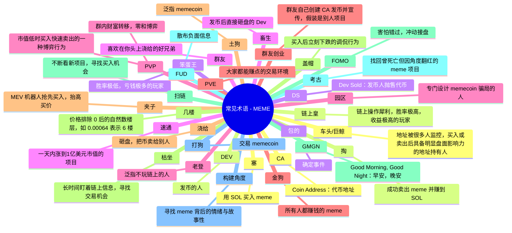

- **车头**：指地址被很多人监控，买入或卖出后具备明显盘面影响力的地址持有人  
- **浇给**：把币卖给别人，就是砸盘的意思  
- **包的**：形容一个确定的事件  
- **CA**：把代币合约地址发出来  
- **枯坐**：指长时间盯着链上信息，寻找机会的一种交易行为  
- **链上皇**：链上操作犀利，胜率极高，收益极高的玩家  
- **笨蛋王**：胜率极低，亏钱极多的玩家  
- **盖帽**：买入就下跌的一种行为调侃  
- **PVP**：在市值极低的时候买入，并快速赚取收益的一种交易行为，同时对应的有人会亏损  
- **战壕**：指在链上交易 memecoin，风险极高，犹如在战壕里打仗  
- **扫链**：不断地看发行的新资产，寻找可以买入的时机  
- **角度**：memecoin 重要的是情绪和故事性，如何发现这种虚拟的价值？大家称为“找角度”  
- **畜生**：Dev 发币后直接砸盘  
- **群友**：指喜欢在你头上浇给的好兄弟  
- **速通**：1 天内从 0 到 1 亿美金市值的项目  
- **考古**：已经死亡的 memecoin，因为某些角度又被大家爆买  
- **PVP（群内版）**：群内财富转移，交易者间零和博弈  
- **PVE**：大家都能赚点  
- **老登**：泛指不玩链上的人  
- **金狗**：大家都赚钱的 memecoin  
- **土狗**：泛指 memecoin  
- **打狗**：泛指交易 memecoin  
- **DEV**：发币的人  
- **DS（Dev Sold）**：指发币人卖币了  
- **园区**：指专门设计 memecoin 诈骗的人  
- **塞**：用 SOL 买入 memecoin  
- **掏**：成功卖出并赚到了 SOL  
- **群友创业**：指在 meme 群里，不认识的群友发一个 CA 加上一个刁钻的角度告诉大家在其他地方看到让大家冲，实质是该群友自己创建的 CA  
- **几楼**：指价格排除 0 以外第一个自然数，通常用在方便表达价格的语境。如某 meme，上车价格为 0.00064，现价为 0.00093，通常表达为“我在 6 楼上车，现在 9 楼”  
- **夹子**：指在你买入之前，MEV 机器人抢先购买（会导致你的交易执行价格变高），等你的交易完成后，它再快速卖出获利，也就是说你本来能买 100 个代币，但最后只到手 90 个甚至更少；买卖时记得在 GMGN 设置防夹子  
- **FOMO**：害怕错过，赶紧接盘买入  
- **FUD**：散布项目的负面信息  
- **GMGN**：Good Morning, Good Night，早安，晚安

## 参考资料
[^1]: [GMGN：从0刀1000万美金Meme操作指南](/crypto/others/GMGN：从0到1000万美金Meme操作指南.pdf)
